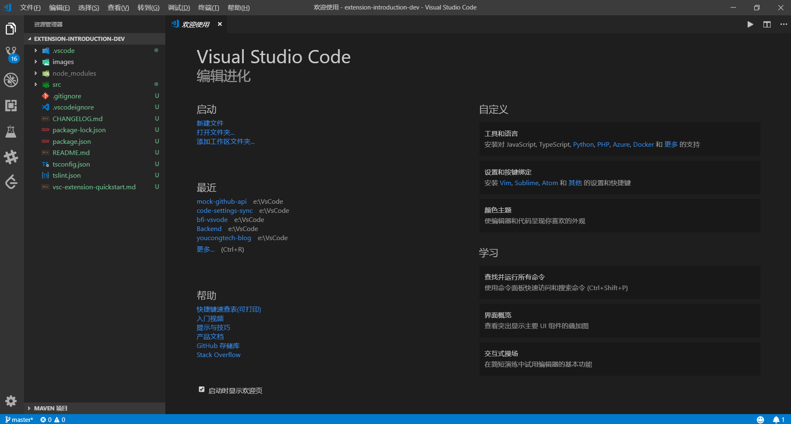
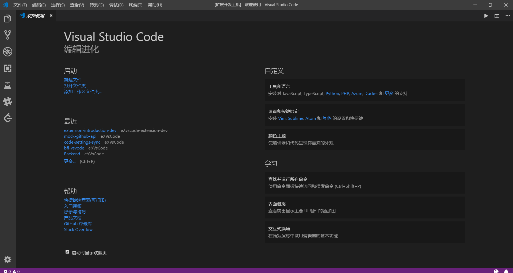
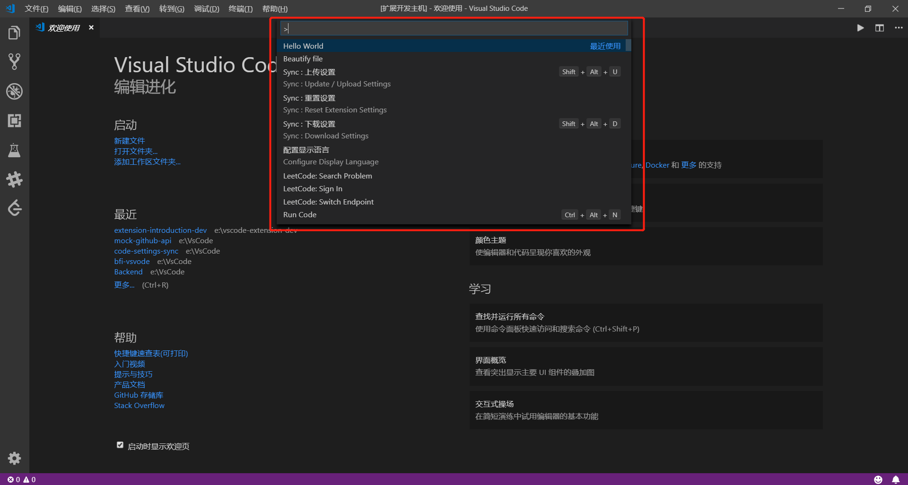
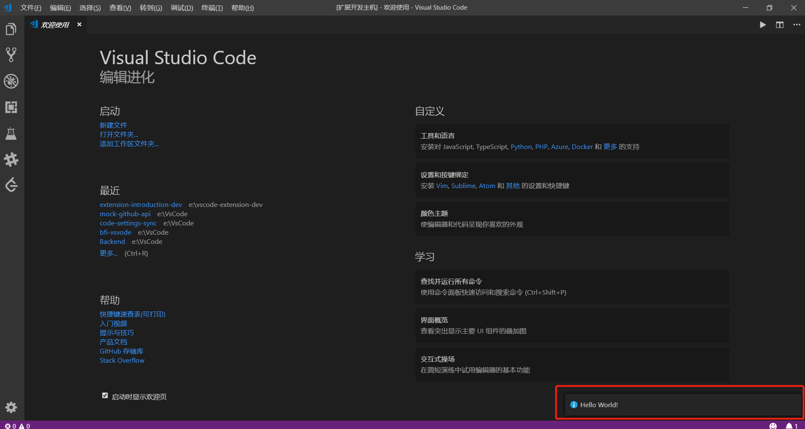
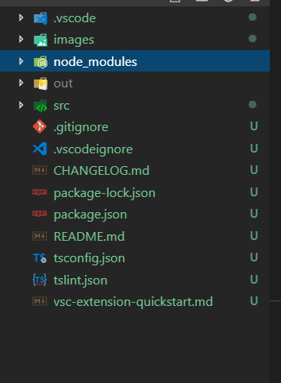

## VsCode插件入门

#### 一、流程

###### 1.安装插件代码生成器
```
npm install -g yo generator-code

```

###### 2.运行生成器
```
yo code

```
会出现如下让你选择：
```

     _-----_     ╭──────────────────────────╮
    |       |    │   Welcome to the Visual  │
    |--(o)--|    │   Studio Code Extension  │
   `---------´   │        generator!        │
    ( _´U`_ )    ╰──────────────────────────╯
    /___A___\   /
     |  ~  |
   __'.___.'__
 ´   `  |° ´ Y `

? What type of extension do you want to create? (Use arrow keys)
? What type of extension do you want to create? New Extension (TypeScript) //选择使用什么语言开发vscode插件，通常有两种，一种是JavaScript，另外一种是TypeScript。

? What's the name of your extension? extension-introduction-dev //插件名字
? What's the name of your extension? extension-introduction-dev
? What's the identifier of your extension? (extension-introduction-dev) //插件唯一标识
? What's the identifier of your extension? extension-introduction-dev
? What's the description of your extension? 插件入门开发示例 //插件描述
? What's the description of your extension? 插件入门开发示例
? Enable stricter TypeScript checking in 'tsconfig.json'? (Y/n)  Y //是否启用更严格的TypeScript检查
? Enable stricter TypeScript checking in 'tsconfig.json'? Yes
? Setup linting using 'tslint'? (Y/n) y //是否使用tsling(专门用于typescript书写规范)
? Setup linting using 'tslint'? Yes
? Initialize a git repository? (Y/n) Y //是否初始化git存储库
? Initialize a git repository? Yes
? Which package manager to use? (Use arrow keys)
? Which package manager to use? npm  //使用哪个包管理器，通常也是两种，一种是Npm，另外一种是yarn。


```

###### 3.快速打开插件
```
code extension-name(插件名) 

在这里是code extension-introduction-dev

```

会弹出如图:


接下来再按F5就可以运行该插件，不过还会弹出一个窗口(插件)，如图所示:


然后使用快捷键Ctrl+shift+P，如图所示:



并在该输入框输入Hello World，最右下方会有一个Hello World的提示框,如图所示:



#### 二、目录结构分析



node_modules //npm依赖库放置处
out //typescript编译输出js的放置处
src //typescript源码放置处
.gitignore //告诉Git哪些文件不需要添加到版本管理
.vscodeignore  //与.gitignore有异曲同工之妙，告诉vscode那些不需要添加到插件管理(与Visual Studio Team Services有关)
.package.json //管理插件的依赖库和命令(常用配置)
tsconfig.json //用来编译这个项目的根文件和编译选项
tslint.json //语法规则检查文件


参考资料如下:
[vscode插件入门](https://code.visualstudio.com/api/get-started/your-first-extension)
