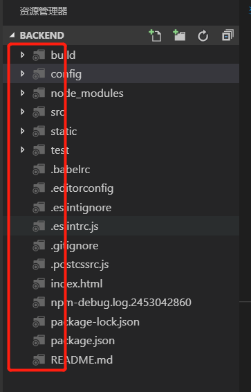

## 自定义图标主题

#### 流程

##### 1.修改package.json
```
{
  "contributes": {
    "iconThemes": [
      {
        "id": "turtles",
        "label": "Turtles",
        "path": "./fileicons/turtles-icon-theme.json"
      }
    ]
  }
}

```

##### 2.新建fileicons目录并在新增turtles-icon-theme.json文件

turtles-icon-theme.json内容如下:

```
{
  
	"iconDefinitions": {
		"_root_folder_dark": {
			"iconPath": "./images/test.svg"
		},
		"_root_folder_open_dark": {
			"iconPath": "./images/test.svg"
		},
		"_folder_dark": {
			"iconPath": "./images/test.svg"
		},
		"_folder_open_dark": {
			"iconPath": "./images/test.svg"
		},
		"_file_dark": {
			"iconPath": "./images/test.svg"
		},
		"_root_folder": {
			"iconPath": "./images/test.svgg"
		},
		"_root_folder_open": {
			"iconPath": "./images/test.svg"
		},
		"_folder_light": {
			"iconPath": "./images/test.svg"
		},
		"_folder_open_light": {
			"iconPath": "./images/test.svg"
		},
		"_file_light": {
			"iconPath": "./images/test.svg"
		}
	},

	"folderExpanded": "_folder_open_dark",
	"folder": "_folder_dark",
	"file": "_file_dark",
	"rootFolderExpanded": "_root_folder_open_dark",
	"rootFolder": "_root_folder_dark",
	"fileExtensions": {
		// icons by file extension
	},
	"fileNames": {
		// icons by file name
	},
	"languageIds": {
		// icons by language id
	},
	"light": {
		"folderExpanded": "_folder_open_light",
		"folder": "_folder_light",
		"rootFolderExpanded": "_root_folder_open",
		"rootFolder": "_root_folder",
		"file": "_file_light",
		"fileExtensions": {
			// icons by file extension
		},
		"fileNames": {
			// icons by file name
		},
		"languageIds": {
			// icons by language id
		}
	},
	"highContrast": {
		// overrides for high contrast
	}
}

```


- file是默认文件图标，显示所有与任何扩展名，文件名或语言ID不匹配的文件。目前，文件图标定义定义的所有属性都将被继承（仅与字体字形相关，对fontSize有用）。


- folder是折叠文件夹的文件夹图标，如果folderExpanded未设置，则也适用于展开的文件夹。可以使用folderNames属性关联特定文件夹名称的图标。文件夹图标是可选的。如果未设置，则不会显示文件夹的图标。


- folderExpanded是展开文件夹的文件夹图标。展开的文件夹图标是可选的。如果未设置，folder将显示为其定义的图标。

- folderNames将文件夹名称关联到图标。该集的关键是文件夹名称，不包括任何路径段。不支持模式或通配符。文件夹名称匹配不区分大小写。


- folderNamesExpanded将文件夹名称关联到展开文件夹的图标。该集的关键是文件夹名称，不包括任何路径段。不支持模式或通配符。文件夹名称匹配不区分大小写。


- rootFolder是折叠的工作空间根文件夹的文件夹图标，如果rootFolderExpanded未设置，则也适用于展开的工作空间根文件夹。如果未设置，folder将为工作区根文件夹显示为其定义的图标。


- rootFolderExpanded是扩展工作区根文件夹的文件夹图标。如果未设置，rootFolder将为展开的工作区根文件夹显示为其定义的图标。


- languageIds将语言与图标相关联。集合中的键是语言贡献点中定义的语言ID 。根据语言贡献中定义的文件扩展名和文件名评估文件的语言。请注意，不考虑语言贡献的“第一行匹配”。


- fileExtensions将文件扩展名关联到图标。集合中的键是文件扩展名。扩展名是点后的文件名段（不包括点）。具有多个点的文件名，例如lib.d.ts可以匹配多个扩展名; 'd.ts'和'ts'。扩展比较不区分大小写。


- fileNames将文件名与图标相关联。集合中的密钥是完整文件名，不包括任何路径段。不支持模式或通配符。文件名匹配不区分大小写。'fileName'匹配是最强匹配，并且与文件名关联的图标将优先于匹配的fileExtension的图标以及匹配的语言Id。

3.效果图



补充内容:

如果是想自定义字体，可将turtles-icon-theme.json修改为如下即可:
```
{
  "fonts": [
    {
      "id": "turtles-font",
      "src": [
        {
          "path": "./turtles.woff",
          "format": "woff"
        }
      ],
      "weight": "normal",
      "style": "normal",
      "size": "150%"
    }
  ],
  "iconDefinitions": {
    "_file": {
      "fontCharacter": "\\E002",
      "fontColor": "#5f8b3b",
      "fontId": "turtles-font"
    }
  }
}

```

关于woff字体，请自行google或百度找。



