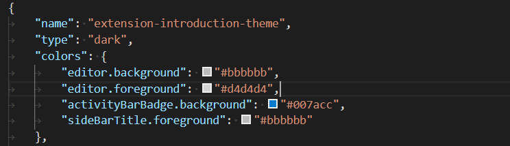
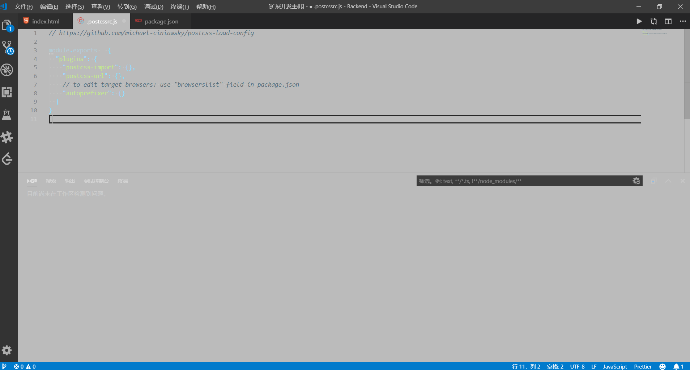
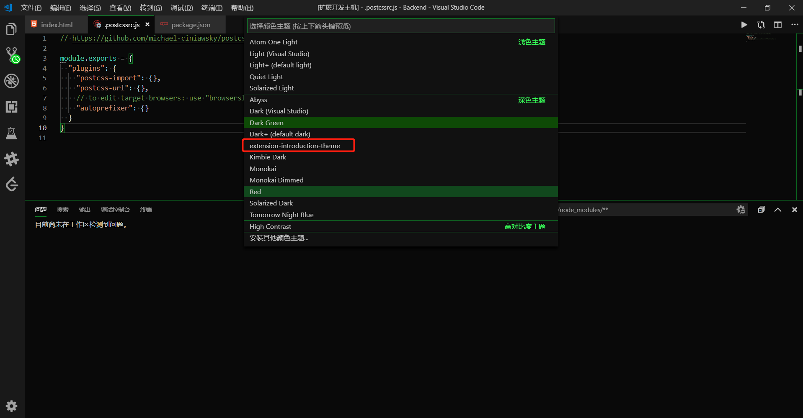

## 如何创建一个新的颜色主题

#### 流程

##### 1.使用代码生成器生成新的主题扩展
```
npm install -g yo generator-code //如果前面已经安装过了，就可以忽略该步骤

yo code //代码扩展生成器(必要步骤)

```

##### 2.自定义主题请按如下步骤执行


##### 3.修改themes文件夹下的json文件可自定义vscode主题颜色

修改文件如图:


显示的对应效果为:



##### 4.在那里，使用文件 > 首选项 > 颜色主题打开颜色主题选择器，您可以在下拉列表中看到您的主题。向上和向下箭头以查看主题的实时预览。




参考资料如下:
[VsCode色彩主题扩展](https://code.visualstudio.com/api/extension-guides/color-theme)

