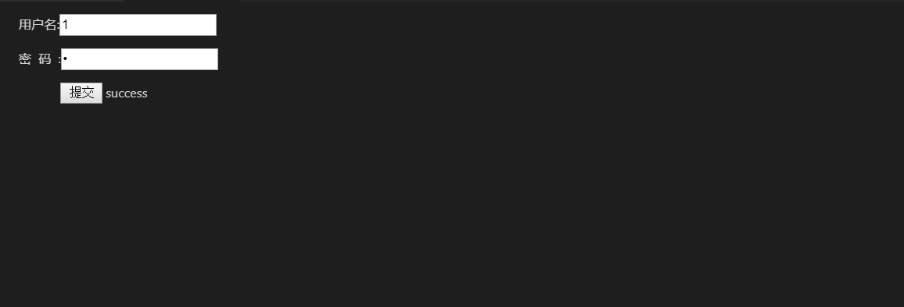

## WebView通信

WebView通信方式如下:
(1)原生js通信/其它前端框架，比如jQuery;
(2)node.js通信;
(3)javascript与node.js如何通信

####  应用场景


##### 1.登录(以typescript编写的webview为例，文件后缀为*.ts或是*.html)
```
import * as vscode from "vscode";

export function activate(context: vscode.ExtensionContext) {
  context.subscriptions.push(
    vscode.commands.registerCommand("Login.start", () => {
      const panel = vscode.window.createWebviewPanel(
        "登陆界面",
        "登陆界面",
        vscode.ViewColumn.One,
        {
          enableScripts: true,
          retainContextWhenHidden: true
        }
      );
      panel.webview.html = getWebviewContent();
    })
  );
}

function getWebviewContent() {
  return `<!DOCTYPE html>
<html lang="en">
<head>
    <meta charset="UTF-8">
    <meta name="viewport" content="width=device-width, initial-scale=1.0">
    <title>登陆界面</title>
</head>
<body>
<form id="login">
<p>用户名:<input type="text" id="userName" style="color:black;"/></p>
<p>密&nbsp;&nbsp;码&nbsp;&nbsp;:<input type="password" id="password" style="color:black;"/></p>
<p>&nbsp;&nbsp;&nbsp;&nbsp;&nbsp;&nbsp;&nbsp;&nbsp;&nbsp;&nbsp;&nbsp;&nbsp;<input type="button" style="color:black;" value="提交" onclick="test()"/>
<span id="test"></span>
</form>

    <script>
    function test(){
      var xhr = new XMLHttpRequest();
      
      xhr.onreadystatechange = function () {
      
      if (xhr.readyState == 4) {
      
        if ((xhr.status >= 200 && xhr.status < 300) || xhr.status == 304) {
      
        console.log(xhr.responseText);

         document.getElementById("test").innerHTML="success";
 
      } else {
     
        console.log(xhr.responseText);

        document.getElementById("test").innerHTML="error";
      
      }
      }
      };
      xhr.open("GET", "http://localhost:8081/hello", true);
      xhr.send(null);            
  } 
  
    </script>
</body>
</html>`;
}


```

效果如图:



构建了一个简单的后端Node.js程序(通过命令行 node index.js即可运行)


index.js
```
var express = require('express');
var app = express();
 
app.all('*', function(req, res, next) {
    res.header("Access-Control-Allow-Origin", "*");
    res.header("Access-Control-Allow-Headers", "X-Requested-With");
    res.header("Access-Control-Allow-Methods","PUT,POST,GET,DELETE,OPTIONS");
    res.header("X-Powered-By",' 3.2.1')
    res.header("Content-Type", "application/json;charset=utf-8");
    next();
});

app.get('/hello', function (req, res) {
   res.send('Hello World');
});
 
var server = app.listen(8081, function () {
 
  var host = server.address().address
  var port = server.address().port
 
  console.log("应用实例，访问地址为 http://%s:%s", host, port)
 
})

```


##### 2. 作为客户端请求后台数据(主要以javascript开发插件，文件后缀名为*.js)
get 请求:
```
var http=require("http");

http.get("http://py.amazingtm.com/index.php?keyword=veblen&keytype=0",function(data){
    var str="";
    data.on("data",function(chunk){
        str+=chunk;//监听数据响应，拼接数据片段
    })
    data.on("end",function(){
        console.log(str.toString())
    })
})

```
或
```
var http = require('http');  
  
var qs = require('querystring');  
  
var data = {  
    a: 123,  
    time: new Date().getTime()};//这是需要提交的数据  
  
  
var content = qs.stringify(data);  
  
var options = {  
    hostname: '127.0.0.1',  
    port: 10086,  
    path: '/pay/pay_callback?' + content,  
    method: 'GET'  
};  
  
var req = http.request(options, function (res) {  
    console.log('STATUS: ' + res.statusCode);  
    console.log('HEADERS: ' + JSON.stringify(res.headers));  
    res.setEncoding('utf8');  
    res.on('data', function (chunk) {  
        console.log('BODY: ' + chunk);  
    });  
});  
  
req.on('error', function (e) {  
    console.log('problem with request: ' + e.message);  
});  
  
req.end();  

```

post 请求:
```
var http = require('http');  
  
var qs = require('querystring');  
  
var post_data = {  
    a: 123,  
    time: new Date().getTime()};//这是需要提交的数据  
  
  
var content = qs.stringify(post_data);  
  
var options = {  
    hostname: '127.0.0.1',  
    port: 10086,  
    path: '/pay/pay_callback',  
    method: 'POST',  
    headers: {  
        'Content-Type': 'application/x-www-form-urlencoded; charset=UTF-8'  
    }  
};  
  
var req = http.request(options, function (res) {  
    console.log('STATUS: ' + res.statusCode);  
    console.log('HEADERS: ' + JSON.stringify(res.headers));  
    res.setEncoding('utf8');  
    res.on('data', function (chunk) {  
        console.log('BODY: ' + chunk);  
    });  
});  
  
req.on('error', function (e) {  
    console.log('problem with request: ' + e.message);  
});  
  
// 将数据写入请求体
req.write(content);//注意这个地方  
  
req.end();

```


##### 3.以创建文件为例(node.js比javascript功能要强大，同时javascript创建文件有其局限性(浏览器不兼容))

一共四个文件(除html外)
createfiles.js //利用node.js创建文件
welcome.js //js与node.js通信关键
test-webview.js //主要保证js能够用vscode api，不然会报vscode未定义
login.js //主要调用处(前面三个文件主要为其服务)

createfiles.js
```
const fs = require('fs');
const path = require('path');
const vscode = require('vscode');

function CreateUserFiles(userName,isRelease) {

     const pathMain = 'd:\\1024Workspace'; //项目存放路径
     var pathUser = pathMain + '\\' + userName;
	var pathCode = pathMain + '\\' + userName + '\\Code';


     if (fs.existsSync(pathMain)) {
          if (!fs.existsSync(pathUser)) {
               fs.mkdir(pathUser, function (err) {
                    if (err) {
                         return console.error(err);
                    }
                    fs.mkdir(pathCode, function (err) {
                         if (err) {
                              return console.error(err);
                         }
                    });
               });
          }
     } else {
          fs.mkdir(pathMain, function (err) {
               if (err) {
                    return console.error(err);
               }
               fs.mkdir(pathUser, function (err) {
                    if (err) {
                         return console.error(err);
                    }
                    fs.mkdir(pathCode, function (err) {
                         if (err) {
                              return console.error(err);
                         }
                    });
               });
          });
     }

     var finpath = '';

     //是否为正式版本，路径不一样
     if (isRelease) {
          const scriptSrc = path.dirname(__filename);
          const jsName = scriptSrc.split('\\');
          var i = jsName.length;


          for (var j = 0; j < i - 5; j++) {

               if (j == 0) {
                    finpath = jsName[j];
               } else {
                    finpath = finpath + '\\' + jsName[j];
               }
          }
		finpath = finpath + '\\users.json';


     } else { //测试版，路径为 'e:\\users123.json';
          finpath = 'e:\\users.json';
     }


     var data = {
          user: userName
     };
     var content = JSON.stringify(data);

     //写入文件
     fs.writeFile(finpath, content, function (err) {
          if (err) {
               return console.log(err);
          }

     });


}

module.exports = CreateUserFiles;


```

welcome.js

```
const vscode = require('vscode');
const util = require('./util');
const fs = require('fs');
const path = require('path');
const create = require('./createuserfiles');

/**
 * 从某个HTML文件读取能被Webview加载的HTML内容
 * @param {*} context 上下文
 * @param {*} templatePath 相对于插件根目录的html文件相对路径
 */
function getWebViewContent(context, templatePath) {
    const resourcePath = util.getExtensionFileAbsolutePath(context, templatePath);
    const dirPath = path.dirname(resourcePath);
    let html = fs.readFileSync(resourcePath, 'utf-8');
    // vscode不支持直接加载本地资源，需要替换成其专有路径格式，这里只是简单的将样式和JS的路径替换
    html = html.replace(/(<link.+?href="|<script.+?src="| {
        return $1 + vscode.Uri.file(path.resolve(dirPath, $2)).with({ scheme: 'vscode-resource' }).toString() + '"';
    });
    return html;
}

/**
 * 执行回调函数
 * @param {*} panel
 * @param {*} message
 * @param {*} resp
 */
function invokeCallback(panel, message, resp) {
    console.log('回调消息：', resp);
    // 错误码在400-600之间的，默认弹出错误提示
    if (typeof resp == 'object' && resp.code && resp.code >= 400 && resp.code < 600) {
        util.showError(resp.message || '发生未知错误！');
    }
    panel.webview.postMessage({cmd: 'vscodeCallback', cbid: message.cbid, data: resp});
}

/**
 * 存放所有消息回调函数，根据 message.cmd 来决定调用哪个方法
 */
const messageHandler = {
    getConfig(global, message) {
        const result = vscode.workspace.getConfiguration().get(message.key);
        invokeCallback(global.panel, message, result);
    },
    setConfig(global, message) {
        // 写入配置文件，注意，默认写入工作区配置，而不是用户配置，最后一个true表示写入全局用户配置
        vscode.workspace.getConfiguration().update(message.key, message.value, true);
        util.showInfo('修改配置成功！');
    }
};

module.exports = function(context) {

    context.subscriptions.push(vscode.commands.registerCommand('extension.demo.showWelcome', function (uri) {
        const panel = vscode.window.createWebviewPanel(
            'testWelcome', // viewType
            "功能页", // 视图标题
            vscode.ViewColumn.One, // 显示在编辑器的哪个部位
            {
                enableScripts: true, // 启用JS，默认禁用
            }
		);

		let global = { panel};

		panel.webview.html = getWebViewContent(context, 'src/view/custom-welcome.html');

        //创建文件
        panel.webview.onDidReceiveMessage(message => {

			switch (message.command) {


				case 'login':

				create(message.text,true);

				break;


				default:


			}

		}, undefined, context.subscriptions);


    }));

    const key2 = 'vscodePluginDemo.showOverlay';
	if (vscode.workspace.getConfiguration().get(key2) === true) {
	vscode.commands.executeCommand('workbench.action.showInterfaceOverview');
	vscode.workspace.getConfiguration().update(key2, false , true);
	}

};


```


login.js
```
//与node.js交互关键
function openCheck(nickName) {

	vscode.postMessage({
		command: 'login',
		text: nickName
	});
}


//登录功能
function loginFunction() {

	var username = $("#username").val();
	var password = $("#password").val();
	var key1 = "1024funIDE";
	var key2 = "Artificial";
	var key3 = "Intelligence";

	//des加密方法
	var  passwords = strEnc(password,key1,key2,key3);


	console.log("passwords:"+passwords);

	if (username == null || username == "") {

		layui.use('layer', function () {
			var layer = layui.layer;

			layer.msg("请输入用户名", {
				icon: 5
			});
		});

	} else if (password == null || password == "") {

		layui.use('layer', function () {
			var layer = layui.layer;

			layer.msg("请输入密码", {
				icon: 5
			});
		});

	} else if (username != null && password != null) {
		$.ajax({
			type: "POST",
			timeout: 10000, // 超时时间 10 秒
			headers: {
				'version': "2.6",
				'from': "IDE"
			},
			url: "http://localhost:8090/bfi-web/api/login",
			data: {
				"username": username,
				"password": password
			},
			dataType: "json",
			success: function (data, textStatus, response) {


				if (data.code == "111111") {
					layui.use('layer', function () {
						var layer = layui.layer;

						layer.msg(data.msg, {
							icon: 5
						});
					});

				} else if (data.code == "000000") {


					layui.use('layer', function () {
						var layer = layui.layer;

						layer.msg(data.msg, {
							icon: 1
						});
					});


					console.log("store:" + response.getResponseHeader("token"));

					openCheck(data.data.userName);

					setTimeout(() => {
						closeLayui();
					}, 700);


					$("#token").val(response.getResponseHeader("token"));
					$("#login").hide();
					$("#exit").show();
					$("#user").html(data.data.nickName);
					$(".user").show();

				}

			},
			error: function (XMLHttpRequest, textStatus, errorThrown) {

				console.log(XMLHttpRequest.status);
				console.log(XMLHttpRequest.readyState);
				console.log(textStatus);
			}
		})
	}

}


```


test-webview.js
```
const testMode = false; // 为true时可以在浏览器打开不报错
// vscode webview 网页和普通网页的唯一区别：多了一个acquireVsCodeApi方法
const vscode = testMode ? {} : acquireVsCodeApi();
const callbacks = {};

/**
 * 调用vscode原生api
 * @param data 可以是类似 {cmd: 'xxx', param1: 'xxx'}，也可以直接是 cmd 字符串
 * @param cb 可选的回调函数
 */
function callVscode(data, cb) {
    if (typeof data === 'string') {
        data = { cmd: data };
    }
    if (cb) {
        // 时间戳加上5位随机数
        const cbid = Date.now() + '' + Math.round(Math.random() * 100000);
        callbacks[cbid] = cb;
        data.cbid = cbid;
    }
    vscode.postMessage(data);
}

window.addEventListener('message', event => {
    const message = event.data;
    switch (message.cmd) {
        case 'vscodeCallback':
            console.log(message.data);
            (callbacks[message.cbid] || function () { })(message.data);
            delete callbacks[message.cbid];
            break;
        default: break;
    }
});

new Vue({
    el: '#app',
    data: {
        projectName: '加载中',
    },
    mounted() {
        callVscode('getProjectName', projectName => this.projectName = projectName);
    },
    watch: {
    },
    methods: {
        // 模拟alert
        alert(info) {
            vscode.window.showInformationMessage('你好 !!!!!!');
            callVscode({ cmd: 'alert', info: info }, null);
        },
        // 弹出错误提示
        error(info) {
            vscode.window.showInformationMessage('你好  我打开的是啥 !!!!!!');
            callVscode({ cmd: 'error', info: info }, null);

        },
        openFileInFinder() {
            callVscode({cmd: 'openFileInFinder', path: `package.json`}, () => {
                this.alert('打开成功！');
                vscode.window.showInformationMessage('你好  我打开的是 openFileInFinder');
            });
        },
        openFileInVscode() {
            callVscode({cmd: 'openFileInVscode', path: `package.json`}, () => {
                this.alert('打开package.json成功！');
                vscode.window.showInformationMessage('你好  我打开的是 openFileInVscode');
            });
        },
        openUrlInBrowser() {
            callVscode({cmd: 'openUrlInBrowser', url: `https://artist.alibaba.com/`}, () => {
                this.alert('打开前端艺术家主页成功！');
                vscode.window.showInformationMessage('你好  我打开的是 openUrlInBrowser');
            });
        }
    }
});


function myFunction() {
    vscode.window.showInformationMessage('你好  我打开的是 !!!!!!');
}

```


参考资料如下:
VsCode关于WebView的官方文档:https://code.visualstudio.com/api/extension-guides/webview
VSCode插件开发全攻略(javascript开发vscode插件示例):https://www.cnblogs.com/liuxianan/p/vscode-plugin-overview.html